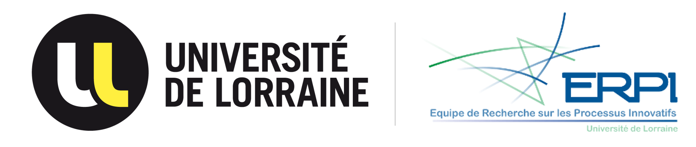

  <h1 align="center">Equipe de Recherche sur les Processus Innovatifs - ERPI </h1>
  

# Welcome 👋

This is the GitHub organization of the [ERPI Research Lab](http://erpi.univ-lorraine.fr/),  at the [Université de Lorraine (UL)](https://www.univ-lorraine.fr/). 

This respository gather the productions related to research activities of the laboraotories. It can be software from a research project, dataset or even data analysis associated to a publication. 

🧑‍💻 We welcome contributions of any kind to improve the quality of the content shared. 